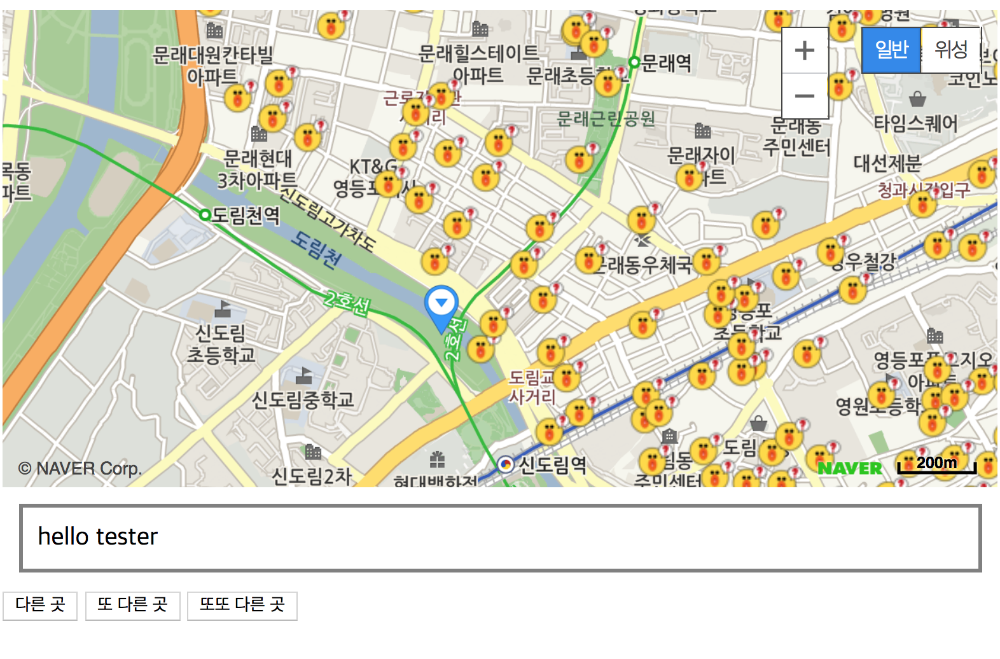
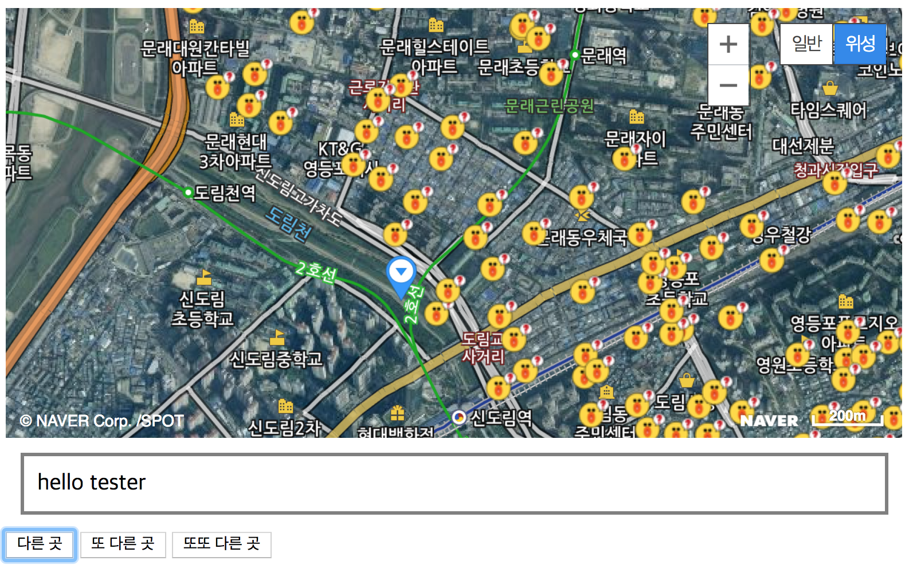
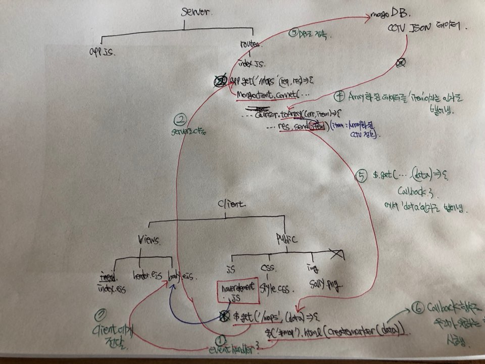
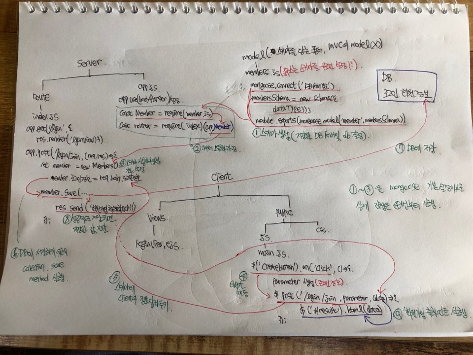

mongoDB에 저장된 데이터를 불러와서 NAVER API 인자로 넣어주기
=============

----------

_실제 구현을 확인하기 위해서는 brew를 통한 mongod(mongodb 서버를 열어주는 역할) , mongo(DB에서 수행되는 CRUD를 확인하기 위한 역할) 패키지를 설치해야한다._

## 1. 데이터 처리 방법 ##
### 1.1 공공데이터 처리

CSV파일을 이용하여 mongoDB에 수동적으로 import ( 추후 다른 방법을 고안 하고자 한다. )

    $ mongoimport --db {using db name} --collection {collection name} --type csv --headerline --file {file name}.csv

추가로, import 된 data를 aggregate framework를 통해 GEOJSON 형식 및 불필요한 정보들을 제거하였다. 

### 1.2 공공데이터 활용 

mongoose 모듈을 통한 데이터 import가 실패하여 mongodb 모듈을 불러와 MongoClient를 활용한 mongoDB와의 통신을 활용한다. ( 추후 다른 방법을 고안하고자 한다. )

### 1.3 회원정보(로그인 정보) DB 구축 

_mongo는 SQL과 다르게 data type을 가리지 않고 받아온다는 특징을 갖고 있다. 하지만, mongoose는 SQL의 특징 중 하나인 'data type을 사전에 지정해줘야한다.' 를   **Schema** 로 구현하여  **Schema** 를 이용하여 통신한다 ._

node의 모듈인 mongoose를 활용하여 mongoDB와 통신 

----------

## 2. NAVER API 활용 ##

구현하고자 하는 부분은 위에서 구축한 기본 데이터를 활용하여 DB,  server(router), client 간 통신을 확인하고자 하였고,  NAVER API를 활용하여 MAP을 깔고 실제 위치한 CCTV 위치를 마커로 표시하고자 하였다.  
더 나아가 navigator.geolocation 메소드를 이용하여 사용자의 위치를 판단하고자 하였다.

_활용 도구 : jquery를 이용한 통신, naver api, ejs, navigator.geolocation 메소드_
_기본 html 베이스는 파일 참고바람_

### 2.1  NAVER API 이용

네이버에서 제공하는 tutorial을 통해 기본 맵 구축하는 방법을 소개하고자 한다. 
네이버는 자바스크립트 문을 통해 제공되며, 본인은 template(view)와 js파일(public/js) 로 구분하여 관리하였다. 

##### 2.1.1 template 관리 
_view/index.ejs_
_view/header.ejs_
_view/body.ejs_

##### 2.1.2 naver api 활용방법
_public/js/naverelement.js_
_public/js/findmyloca.js_

### 2.2  구현 사례 

----------

DB를 활용한 전체적인 흐름
=============

